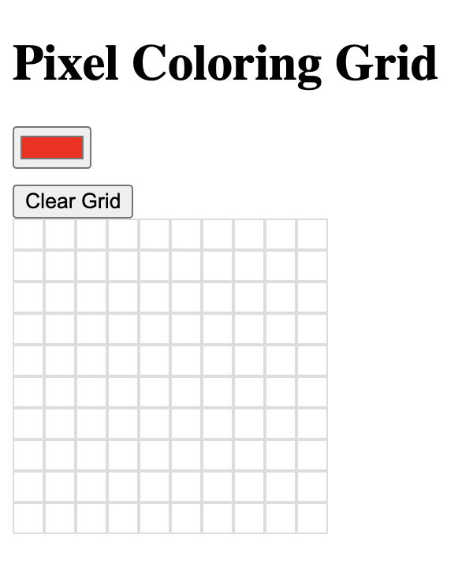

# Pixel Coloring Grid

## Description

This project is a simple pixel coloring grid. Users can select a color using a color picker and click on the cells in the grid to color them. There is also a clear button to reset the grid.

## How to Use

1. Select a color using the color picker.
2. Click on a cell in the grid to color it.
3. Click the clear button to reset the grid.

## Project Structure

- `index.html`: The main HTML file.
- `styles.css`: The CSS file for styling.
- `script.js`: The JavaScript file for functionality.
